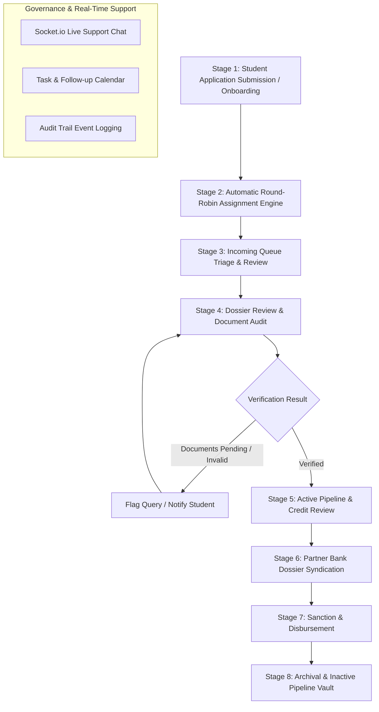

# VidyaLoans Staff Dashboard — Complete End-to-End Operational Master Document

> **Document Classification**: System Technical & Operational Specification  
> **Target Audience**: Software Engineers, Operations Leads, System Administrators, & Product Managers  
> **Platform Version**: 2.4.0-PROD  
> **Last Synchronized**: August 6, 2026  

---

## Table of Contents
1. [Executive Summary & Purpose](#1-executive-summary--purpose)
2. [Architectural Overview & Technology Stack](#2-architectural-overview--technology-stack)
3. [End-to-End Operational Lifecycle](#3-end-to-end-operational-lifecycle)
4. [Full Directory & Route Hierarchy](#4-full-directory--route-hierarchy)
5. [Detailed UI Page & Component Specifications](#5-detailed-ui-page--component-specifications)
   - 5.1 [Global Layout & Navigation Shell](#51-global-layout--navigation-shell-appstafflayouttsx)
   - 5.2 [Operational Overview Dashboard](#52-operational-overview-dashboard-appstaffdashboardpagetsx)
   - 5.3 [Incoming Applications Queue](#53-incoming-applications-queue-appstaffincoming-queuepagetsx)
   - 5.4 [Active Applications Pipeline](#54-active-applications-pipeline-appstaffapplicationspagetsx)
   - 5.5 [Archived Inactive Pipeline](#55-archived-inactive-pipeline-appstaffinactive-pipelinepagetsx)
   - 5.6 [Student Dossier & Verification Manager](#56-student-dossier--verification-manager-appstaffusersidpagetsx)
   - 5.7 [Multi-step Applicant Onboarding Wizard](#57-multi-step-applicant-onboarding-wizard-appstaffonboardingpagetsx)
   - 5.8 [Tasks, Calendar & Follow-up Scheduler](#58-tasks-calendar--follow-up-scheduler-appstafftaskspagetsx)
   - 5.9 [Performance Analytics & SLA Tracking](#59-performance-analytics--sla-tracking-appstaffperformancepagetsx)
   - 5.10 [Outreach & Communications Center](#510-outreach--communications-center-appstaffcommunicationspagetsx)
   - 5.11 [Real-Time Support Chat](#511-real-time-support-chat-appstaffchat-customerpagetsx)
   - 5.12 [Helpdesk Support Tickets](#512-helpdesk-support-tickets-appstaffsupport-ticketspagetsx)
   - 5.13 [Staff Profile & Personal Governance](#513-staff-profile--personal-governance-appstaffmy-profilepagetsx)
6. [Automated Round-Robin Assignment Engine](#6-automated-round-robin-assignment-engine)
7. [Progress Calculation & Stage Standardisation Rules](#7-progress-calculation--stage-standardisation-rules)
8. [Document Verification & Student Back-Sync Protocol](#8-document-verification--student-back-sync-protocol)
9. [Backend API Reference & Controllers](#9-backend-api-reference--controllers)
10. [Database Schemas & Data Model Specifications](#10-database-schemas--data-model-specifications)
11. [Real-time WebSockets & Audit Trail Event System](#11-real-time-websockets--audit-trail-event-system)

---

## 1. Executive Summary & Purpose

The **VidyaLoans Staff Dashboard** is the primary operational environment for loan officers, underwriting specialists, team leads, and administrators. It aggregates loan applications, student profile dossiers, partner bank coordination, document verification workflows, real-time messaging, and governance tools into a centralized web workspace.

### Key Operational Goals
- **Minimize Application Turnaround Time (TAT)** through automated round-robin assignment and real-time SLA tracking.
- **Ensure Regulatory & KYC Compliance** via automated OCR document scanning and structured verification workflows.
- **Facilitate Multi-Bank Syndication** by enabling secure export of applicant document packages directly to partner bank portals.
- **Provide Total Operational Transparency** with real-time audit trail logs tracking every document modification, status transition, and staff interaction.

---

## 2. Architectural Overview & Technology Stack

```
┌──────────────────────────────────────────────────────────────────────────────────┐
│                               FRONTEND ARCHITECTURE                              │
│  Next.js 15 (App Router) • React 19 • Tailwind CSS • Framer Motion • Socket.io   │
└────────────────────────────────────────┬─────────────────────────────────────────┘
                                         │ REST APIs & WebSockets
                                         ▼
┌──────────────────────────────────────────────────────────────────────────────────┐
│                                BACKEND ARCHITECTURE                              │
│       NestJS (Node.js) • Supabase Client (PostgreSQL) • EventEmitter2 • Multer   │
└────────────────────────────────────────┬─────────────────────────────────────────┘
                                         │ Database Mutations & Queries
                                         ▼
┌──────────────────────────────────────────────────────────────────────────────────┐
│                                 DATABASE & STORAGE                               │
│           PostgreSQL (Supabase) • Supabase Storage Buckets • Redis Cache         │
└──────────────────────────────────────────────────────────────────────────────────┘
```

- **Frontend Framework**: Next.js (TypeScript, React `useContext`, `useCallback`, `useMemo`).
- **Styling & Aesthetics**: Tailwind CSS with custom palette (`#0A2540` deep navy, `#4F46E5` indigo, HSL status badges, glassmorphism UI).
- **Real-Time Communication**: Socket.io client connected to `ws://localhost:5000/chat` for live presence and chat synchronization.
- **Backend API Layer**: NestJS REST controllers (`/api/staff-profiles`, `/api/assignment`, `/api/admin`, `/api/chat`).
- **Data Layer**: Supabase PostgreSQL tables (`LoanApplication`, `StaffProfile`, `DashboardActivity`, `AssignmentTracker`, `LoanAssignmentHistory`).

---

## 3. End-to-End Operational Lifecycle

The life cycle of a student loan application inside the staff dashboard follows an eight-stage flow:



### Detailed Lifecycle Stages

1. **Stage 1 — Application Ingestion**:
   - Applicant submits their loan application via the public portal **OR** staff manually inputs data using the **Multi-Step Onboarding Tool** (`/staff/onboarding`).
2. **Stage 2 — Automated Assignment Engine**:
   - `AssignmentService.assignLoan()` triggers. It evaluates active staff members, checks current workload counts, filters by loan type specialization, and updates `LoanApplication.assignedStaffId` using the global round-robin index tracker (`AssignmentTracker`).
3. **Stage 3 — Incoming Queue Triage (`/staff/incoming-queue`)**:
   - Newly assigned files enter the staff queue. Staff can view priority tags (Urgent, High, Normal), claim unassigned cases, reassign applications, or trigger direct callbacks.
4. **Stage 4 — Dossier & Document Audit (`/staff/users/[id]`)**:
   - Staff audits applicant, co-borrower, and guarantor KYC, income proofs, collateral, and academic documents.
   - Staff approves or rejects each document. Rejection requires a mandatory reason, which back-syncs to the student's portal view and triggers an automated notification.
5. **Stage 5 — Active Pipeline Processing (`/staff/applications`)**:
   - Applications with verified documents transition to `processing` or `under_bank_review`. Progress bars automatically update (25% → 40% → 50% → 75% → 90% → 95% → 100%).
6. **Stage 6 — Partner Bank Syndication (`shareWithBank` / `shareProfile`)**:
   - Verified student profiles are bundled into encrypted document packages and shared with partner bank loan officers via email links.
7. **Stage 7 — Sanction & Disbursement**:
   - Bank issues sanction letter. Staff logs sanction terms and moves application status to `sanctioned` and subsequently `disbursed`.
8. **Stage 8 — Inactive Pipeline Archival (`/staff/inactive-pipeline`)**:
   - Cancelled, rejected, or completed applications move to the inactive vault with tagged rejection reasons for analytical reporting.

---

## 4. Full Directory & Route Hierarchy

```
frontend/app/staff/
├── layout.tsx                        # Global Layout Shell (Navigation, Top Bar, Search, WebSockets)
├── page.tsx                          # Base redirect handler to /staff/dashboard
├── dashboard/
│   └── page.tsx                      # Main Dashboard (Operational Overview & Audit Trail Logs Drawer)
├── incoming-queue/
│   └── page.tsx                      # Triage Queue for incoming & unassigned applications
├── applications/
│   └── page.tsx                      # Active Loan Applications Pipeline Manager
├── inactive-pipeline/
│   └── page.tsx                      # Archived Vault for cancelled, rejected & closed files
├── inactive-applications/
│   └── page.tsx                      # Alternative view wrapper for inactive files
├── users/
│   ├── page.tsx                      # Staff Roster, Role Controls & Student Directory
│   └── [id]/
│       └── page.tsx                  # Student Dossier, Verification Panel & Document Manager
├── onboarding/
│   └── page.tsx                      # 5-Step Applicant Creation & Onboarding Wizard
├── tasks/
│   └── page.tsx                      # Follow-up Reminders Scheduler & Task Checklists
├── calendar/
│   └── page.tsx                      # Deadline & Follow-up Calendar View
├── performance/
│   └── page.tsx                      # Individual & Team Performance & SLA Analytics
├── communications/
│   └── page.tsx                      # Outreach Center (Email, SMS & Broadcast Templates)
├── chat-customer/
│   └── page.tsx                      # Live Customer Support Chat (Socket.io)
├── support-tickets/
│   └── page.tsx                      # Helpdesk Ticket Manager
├── my-profile/
│   └── page.tsx                      # Staff Member Personal Profile & Action History
└── login/
    └── page.tsx                      # Dedicated Staff Portal Authentication Page
```

---

## 5. Detailed UI Page & Component Specifications

### 5.1 Global Layout & Navigation Shell (`app/staff/layout.tsx`)
- **File Path**: [frontend/app/staff/layout.tsx](file:///c:/Projects/Sun%20Glade/Loan/frontend/app/staff/layout.tsx)
- **Primary Function**: Acts as the wrapper for all `/staff/*` routes. Manages global navigation, WebSocket presence, unread chat badges, and global search.
- **Key Features**:
  - **F30 Global Search**: Search bar with real-time autocompletion across application numbers, student names, phone numbers, and emails.
  - **Real-Time IST Clock**: Topbar digital clock configured to `Asia/Kolkata` (`MMM dd, HH:mm:ss`).
  - **WebSocket Presence Provider**: Emits `request_presence` and listens to `presence_update` to track online staff members.
  - **Dynamic Collapsible Sidebar**: Includes navigation links with real-time badge counts for Incoming Queue, Active Pipeline, Support Chat, and Reminders.

### 5.2 Operational Overview Dashboard (`app/staff/dashboard/page.tsx`)
- **File Path**: [frontend/app/staff/dashboard/page.tsx](file:///c:/Projects/Sun%20Glade/Loan/frontend/app/staff/dashboard/page.tsx)
- **Primary Function**: Provides real-time operational visibility into loan metrics, today's summary, pipeline stages, and administrative audit logs.
- **Key Features**:
  - **Top KPI Cards**: Total Applications, Awaiting Review (pending count), Approval Rate (%, monthly trends), Total Users.
  - **F29 Today's Operational Summary**: Highlights Urgent Cases, New Admissions (last 24h), Responded Queries, Pending Decisions, Pending Disbursements.
  - **Pipeline Stage Breakdown**: Horizontal distribution bars tracking status frequencies (`submitted`, `documents_pending`, `processing`, `approved`, `disbursed`, `rejected`).
  - **Activity Log & Audit Trail Panel**: Side widget displaying recent system events, with a view switcher to inspect the full paginated audit trail filtered by staff member, event type, or search term.

### 5.3 Incoming Applications Queue (`app/staff/incoming-queue/page.tsx`)
- **File Path**: [frontend/app/staff/incoming-queue/page.tsx](file:///c:/Projects/Sun%20Glade/Loan/frontend/app/staff/incoming-queue/page.tsx)
- **Primary Function**: Operational queue for inspecting, claiming, and triaging new incoming loan applications.
- **Key Features**:
  - **Filter Controls**: Filter by assignment status (`My Applications`, `Unassigned`, `All Staff`), Loan Type, Priority, Date Range.
  - **Fast Action Modals**: Claim application, reassign staff, trigger direct email notification, schedule follow-up callback.
  - **Urgent File Flagging**: Visual indicators for SLA breaches (>48h unassigned) and high-priority flags.

### 5.4 Active Applications Pipeline (`app/staff/applications/page.tsx`)
- **File Path**: [frontend/app/staff/applications/page.tsx](file:///c:/Projects/Sun%20Glade/Loan/frontend/app/staff/applications/page.tsx)
- **Primary Function**: Comprehensive management table for all actively processing loan applications.
- **Key Features**:
  - **Tabbed Filtering**: All Active, Submitted, Under Review, Bank Review, Sanctioned.
  - **Progress Visualizer**: Displays calculated percentage completion bar (0-100%).
  - **Exporting Capabilities**: CSV export of application data.

### 5.5 Archived Inactive Pipeline (`app/staff/inactive-pipeline/page.tsx`)
- **File Path**: [frontend/app/staff/inactive-pipeline/page.tsx](file:///c:/Projects/Sun%20Glade/Loan/frontend/app/staff/inactive-pipeline/page.tsx)
- **Primary Function**: Secure vault storing closed, rejected, cancelled, and withdrawn loan applications.
- **Key Features**:
  - **Rejection Category Analytics**: Categorizes rejections by reason (Ineligible Credit Score, Missing Financial Documents, University Unrecognized, User Withdraw).
  - **Restore / Re-open Action**: Allows authorized staff/admins to restore mistakenly closed applications back into the active queue.

### 5.6 Student Dossier & Verification Manager (`app/staff/users/[id]/page.tsx`)
- **File Path**: [frontend/app/staff/users/[id]/page.tsx](file:///c:/Projects/Sun%20Glade/Loan/frontend/app/staff/users/[id]/page.tsx)
- **Primary Function**: Individual student application control panel.
- **Key Features**:
  - **Document Audit Matrix**: List of required vs uploaded documents (Aadhaar, PAN, ITR, Salary Slips, Admission Letter, Marksheets).
  - **Approve / Reject Controls**: One-click status toggles with mandatory rejection reason fields that trigger automated back-sync.
  - **Staff Document Upload**: Allows staff to upload missing documents on behalf of students.
  - **Bank Share Tool**: Generates secure shareable dossiers for partner banks.

### 5.7 Multi-step Applicant Onboarding Wizard (`app/staff/onboarding/page.tsx`)
- **File Path**: [frontend/app/staff/onboarding/page.tsx](file:///c:/Projects/Sun%20Glade/Loan/frontend/app/staff/onboarding/page.tsx)
- **Primary Function**: 5-step guided wizard for staff to register new students manually.
- **Steps**:
  1. *Basic Info & Contact*: Name, email, phone, DOB, gender.
  2. *Academic & University Details*: Target country, university name, course name, start/end dates.
  3. *Loan & Financial Requirements*: Requested loan amount, co-borrower income, collateral type.
  4. *Document Collection & OCR*: Upload and auto-scan KYC and financial records.
  5. *Bank Preference & Submission*: Select target lender bank and submit file directly to assignment queue.

### 5.8 Tasks, Calendar & Follow-up Scheduler (`app/staff/tasks/page.tsx`)
- **File Path**: [frontend/app/staff/tasks/page.tsx](file:///c:/Projects/Sun%20Glade/Loan/frontend/app/staff/tasks/page.tsx)
- **Primary Function**: Personal and team productivity center.
- **Key Features**:
  - **Interactive Follow-up Calendar**: Renders scheduled callbacks and document verification deadlines.
  - **Conflict Detection Engine**: Uses `checkFollowUpConflict()` to prevent double-booking staff time slots.
  - **Task Lists**: Checklist for daily staff duties with completion state sync.

### 5.9 Performance Analytics & SLA Tracking (`app/staff/performance/page.tsx`)
- **File Path**: [frontend/app/staff/performance/page.tsx](file:///c:/Projects/Sun%20Glade/Loan/frontend/app/staff/performance/page.tsx)
- **Primary Function**: Measures individual and team processing performance.
- **Metrics Tracked**: Average processing time per application, approval conversion rates, daily document verification throughput, SLA compliance percentage.

### 5.10 Outreach & Communications Center (`app/staff/communications/page.tsx`)
- **File Path**: [frontend/app/staff/communications/page.tsx](file:///c:/Projects/Sun%20Glade/Loan/frontend/app/staff/communications/page.tsx)
- **Primary Function**: Multi-channel outreach manager.
- **Key Features**: Pre-configured email and SMS templates for document reminders, sanction announcements, and follow-up notes.

### 5.11 Real-Time Support Chat (`app/staff/chat-customer/page.tsx`)
- **File Path**: [frontend/app/staff/chat-customer/page.tsx](file:///c:/Projects/Sun%20Glade/Loan/frontend/app/staff/chat-customer/page.tsx)
- **Primary Function**: Live chat interface connecting staff with applicants via WebSockets.
- **Key Features**: Active conversation lists, online/offline presence indicators, unread message badges, document attachment preview within chat window.

### 5.12 Helpdesk Support Tickets (`app/staff/support-tickets/page.tsx`)
- **File Path**: [frontend/app/staff/support-tickets/page.tsx](file:///c:/Projects/Sun%20Glade/Loan/frontend/app/staff/support-tickets/page.tsx)
- **Primary Function**: Secondary ticket management desk for resolving applicant technical or portal issues.

### 5.13 Staff Profile & Personal Governance (`app/staff/my-profile/page.tsx`)
- **File Path**: [frontend/app/staff/my-profile/page.tsx](file:///c:/Projects/Sun%20Glade/Loan/frontend/app/staff/my-profile/page.tsx)
- **Primary Function**: Personal account management for staff members. Shows personal workload count, assigned loan history, personal activity log, and account credentials.

---

## 6. Automated Round-Robin Assignment Engine

The round-robin assignment logic is governed by [AssignmentService](file:///c:/Projects/Sun%20Glade/Loan/server/src/assignment/assignment.service.ts).

```
   New Loan Application Created/Submitted
                    │
                    ▼
   [AssignmentService.assignLoan(loanId)]
                    │
                    ▼
   Fetch Loan Details & Check if Already Assigned
                    │
      ┌─────────────┴─────────────┐
      ▼                           ▼
[Already Assigned]          [Unassigned]
      │                           │
  Return Existing                 ▼
   Assignment            Fetch Eligible Staff List
                         (isResigned == false)
                                  │
                                  ▼
                         Fetch Last Assigned Staff ID
                         from AssignmentTracker Table
                                  │
                                  ▼
                         Calculate Next Staff Index:
                       nextIndex = (currentIndex + 1) % N
                                  │
                                  ▼
                         Update LoanApplication:
                         - assignedStaffId
                         - assignedStaffName
                         - assignedStaffEmail
                         - assignedAt = NOW()
                                  │
                                  ▼
                         Increment Staff Current Workload
                         (+1 in StaffProfile)
                                  │
                                  ▼
                         Insert Audit Log Entry into
                         LoanAssignmentHistory Table
                                  │
                                  ▼
                         Send Email Notification to
                         Assigned Staff Member
```

---

## 7. Progress Calculation & Stage Standardisation Rules

Application completion percentage (`progress`) is standardized across all dashboard views via `getApplicationDisplayProgress(app)`:

```typescript
const getApplicationDisplayProgress = (app: any): number => {
    const status = (app.status || "").toLowerCase();
    const stage = (app.stage || "").toLowerCase();
    const bankWorkflow = (app.bankWorkflowStatus || "").toUpperCase();

    if (status === "disbursed" || status === "disbursement_confirmed" || status === "closed" || bankWorkflow === "DISBURSED") {
        return 100;
    }
    if (status === "approved" || stage === "sanction" || stage === "sanctioned") {
        return Math.max(app.progress ?? 0, 95);
    }
    if (stage === "bank_review" || status === "under_bank_review" || status === "processing") {
        return Math.max(app.progress ?? 0, 90);
    }
    if (stage === "credit_check" || status === "query_raised") {
        return Math.max(app.progress ?? 0, 75);
    }
    if (stage === "submit_to_bank" || stage === "bank_submission" || status === "submitted_to_bank" || status === "file_logged") {
        return Math.max(app.progress ?? 0, 50);
    }
    if (stage === "document_verification" || status === "staff_verified" || status === "docs_received" || status === "under_review") {
        return Math.max(app.progress ?? 0, 40);
    }
    if (status === "submitted" || stage === "application_submitted") {
        return Math.max(app.progress ?? 0, 25);
    }
    return app.progress ?? 10;
};
```

---

## 8. Document Verification & Student Back-Sync Protocol

When staff updates document statuses inside the dossier manager:

1. **Staff Action**: Staff clicks `Approve` or `Reject` on a document in `/staff/users/[id]`.
2. **API Call**: `PATCH /api/staff-profiles/:id/documents/:docId/status` executed.
3. **Backend Service Execution**:
   - `StaffProfileService.updateDocumentStatus()` updates document status in `StaffProfileDocument`.
   - The service locates the linked student user profile and updates the corresponding record in `UserDocument`.
   - If rejected, `rejection_reason` is saved and an automated email/portal alert is dispatched to the student.
4. **Audit Logging**: `logDashboardActivity()` logs the verification event with details on the document type, student name, and acting staff member.

---

## 9. Backend API Reference & Controllers

All staff endpoints reside under `server/src/staff-profile/staff-profile.controller.ts`:

| Method | Endpoint Path | Function Handler | Description |
| :--- | :--- | :--- | :--- |
| `GET` | `/api/staff-profiles` | `list` | Lists all staff profiles with optional filtering |
| `POST` | `/api/staff-profiles` | `create` | Creates a new staff profile linked to a user account |
| `GET` | `/api/staff-profiles/check/:userId` | `checkExists` | Checks if a staff profile exists for a given user ID |
| `GET` | `/api/staff-profiles/dashboard/today` | `getTodayDashboard` | Returns F29 today's operational summary metrics |
| `GET` | `/api/staff-profiles/dashboard/summary` | `getDashboardSummary` | Returns overall operational dashboard statistics |
| `GET` | `/api/staff-profiles/dashboard/search` | `globalSearch` | Executes F30 global search across system entities |
| `GET` | `/api/staff-profiles/dashboard/activities` | `getActivities` | Fetches top N activities for dashboard widget |
| `GET` | `/api/staff-profiles/activities/all` | `getAllDashboardActivities` | Returns paginated full audit logs with filtering |
| `GET` | `/api/staff-profiles/activities/staff-list` | `getStaffMembers` | Returns roster of staff members for audit filters |
| `GET` | `/api/staff-profiles/:id/documents` | `getDocs` | Fetches documents attached to a staff profile |
| `POST` | `/api/staff-profiles/:id/documents` | `uploadDoc` | Staff uploads a document file to student dossier |
| `PATCH` | `/api/staff-profiles/:id/documents/:docId/status` | `updateStatus` | Updates document status (Approved/Rejected) & back-syncs |
| `POST` | `/api/staff-profiles/:id/share` | `share` | Generates secure document share bundle for partner bank |
| `POST` | `/api/staff-profiles/share-profile/:studentId` | `shareProfile` | Shares full student profile with partner bank officers |
| `PATCH` | `/api/staff-profiles/:id/resign` | `toggleResignation` | Toggles staff member active/resigned status |

---

## 10. Database Schemas & Data Model Specifications

```sql
-- 1. Staff Profile Table
CREATE TABLE "StaffProfile" (
    "id" UUID PRIMARY KEY DEFAULT uuid_generate_v4(),
    "linkedUserId" UUID REFERENCES "User"("id") ON DELETE CASCADE,
    "targetBank" VARCHAR(255),
    "loanType" VARCHAR(255),
    "currentWorkload" INT DEFAULT 0,
    "isResigned" BOOLEAN DEFAULT FALSE,
    "internalNotes" TEXT,
    "createdAt" TIMESTAMP WITH TIME ZONE DEFAULT NOW(),
    "updatedAt" TIMESTAMP WITH TIME ZONE DEFAULT NOW()
);

-- 2. Loan Application Assignment History
CREATE TABLE "LoanAssignmentHistory" (
    "id" UUID PRIMARY KEY DEFAULT uuid_generate_v4(),
    "applicationId" UUID NOT NULL REFERENCES "LoanApplication"("id") ON DELETE CASCADE,
    "fromStaffId" UUID,
    "toStaffId" UUID NOT NULL,
    "assignedBy" VARCHAR(255) NOT NULL,
    "reason" VARCHAR(255) DEFAULT 'round_robin',
    "createdAt" TIMESTAMP WITH TIME ZONE DEFAULT NOW()
);

-- 3. Round-Robin Assignment Tracker
CREATE TABLE "AssignmentTracker" (
    "scope" VARCHAR(100) PRIMARY KEY, -- 'global'
    "lastAssignedStaffId" UUID,
    "updatedAt" TIMESTAMP WITH TIME ZONE DEFAULT NOW()
);

-- 4. Dashboard Activity Log Table
CREATE TABLE "DashboardActivity" (
    "id" UUID PRIMARY KEY DEFAULT uuid_generate_v4(),
    "staffId" UUID,
    "type" VARCHAR(100) NOT NULL, -- 'new', 'update', 'upload', 'share', 'approved', 'rejected'
    "msg" TEXT NOT NULL,
    "icon" VARCHAR(100) DEFAULT 'history',
    "color" VARCHAR(100) DEFAULT 'bg-slate-50 text-slate-600',
    "actorName" VARCHAR(255),
    "actorEmail" VARCHAR(255),
    "createdAt" TIMESTAMP WITH TIME ZONE DEFAULT NOW()
);
```

---

## 11. Real-time WebSockets & Audit Trail Event System

### WebSockets (`ws://localhost:5000/chat`)
- **Connection Auth**: Authenticated via JWT token in handshake (`auth: { token }`).
- **Presence Tracking**:
  - Client emits `request_presence`.
  - Gateway returns `presence_update` with an array of active staff user emails (`string[]`).
- **Notification Signals**:
  - `conversation_updated`: Triggers immediate re-fetch of unread chat counts in the top header.
  - `new_message`: Plays auditory alert and updates badge counters across the layout shell.

### Audit Logging Protocol
Whenever an administrative or staff action occurs (e.g. document status update, bank share, application re-assignment, resignation toggle):
1. `StaffProfileService.logDashboardActivity()` is invoked.
2. The payload records `type`, `msg`, `icon`, `color`, `actorName`, `actorEmail`, and timestamp.
3. The event is immediately queryable via `GET /api/staff-profiles/activities/all` and rendered in real-time in the Audit Trail panel.

---
*End of Master Technical Document.*
