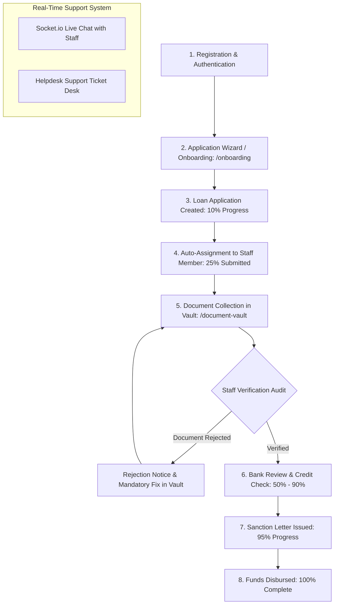

# VidyaLoans User (Student) Dashboard — Complete End-to-End Operational Master Document

> **Document Classification**: System Technical & Operational Specification  
> **Target Audience**: Software Engineers, Product Managers, UI/UX Designers, & Operations  
> **Platform Scope**: Student / Applicant Portal (`/dashboard`, `/document-vault`, `/profile`, `/onboarding`)  
> **Last Synchronized**: August 6, 2026  

---

## Table of Contents
1. [Executive Summary & Portal Purpose](#1-executive-summary--portal-purpose)
2. [Architectural Overview & Access Control](#2-architectural-overview--access-control)
3. [End-to-End Student Operational Lifecycle](#3-end-to-end-student-operational-lifecycle)
4. [Full Directory & Route Hierarchy](#4-full-directory--route-hierarchy)
5. [Detailed UI Page & Component Specifications](#5-detailed-ui-page--component-specifications)
   - 5.1 [Protected User Layout Shell](#51-protected-user-layout-shell-appprotectedlayouttsx)
   - 5.2 [Student Dashboard Overview](#52-student-dashboard-overview-appprotecteddashboardpagetsx)
   - 5.3 [Document Vault & AI Bulk Upload](#53-document-vault--ai-bulk-upload-appprotecteddocument-vaultpagetsx)
   - 5.4 [Student Profile & Family Information](#54-student-profile--family-information-appprotectedprofilepagetsx)
   - 5.5 [Helpdesk Support Ticket Desk](#55-helpdesk-support-ticket-desk-appprotectedsupport-ticketspagetsx)
   - 5.6 [Detailed User Information Manager](#56-detailed-user-information-manager-appprotecteduser-detailspagetsx)
   - 5.7 [Multi-Step Student Loan Application Wizard](#57-multi-step-student-loan-application-wizard-apponboardingonboardingpagetsx)
6. [The 8-Stage Dynamic Progress Tracker](#6-the-8-stage-dynamic-progress-tracker)
7. [Document Requirement Engine & DigiLocker Sync](#7-document-requirement-engine--digilocker-sync)
8. [Backend API Reference & Endpoints](#8-backend-api-reference--endpoints)
9. [Database Schemas & Storage Models](#9-database-schemas--storage-models)
10. [Real-time Events & Live Support Chat](#10-real-time-events--live-support-chat)

---

## 1. Executive Summary & Portal Purpose

The **VidyaLoans User (Student) Dashboard** is the self-service web environment where student loan applicants manage their education loan applications. It guides applicants through university/course selection, multi-bank matching, document collection, real-time application progress tracking across 8 distinct loan stages, live chat with assigned staff members, and sanction letter downloads.

### Key Student Operational Goals
- **End-to-End Application Visibility**: Transparent 8-stage progress tracker from creation (10%) to disbursement (100%).
- **Frictionless Document Vault**: Intelligent drag-and-drop document vault with AI file-type guessing and DigiLocker integration.
- **Direct Staff Connectivity**: Embedded real-time Socket.io support chat to communicate directly with assigned loan processing staff.
- **Sanction Letter Access**: Instant download of official bank sanction letters once loan approval is granted.

---

## 2. Architectural Overview & Access Control

```
┌──────────────────────────────────────────────────────────────────────────────────┐
│                               FRONTEND ARCHITECTURE                              │
│  Next.js 15 (App Router) • Protected Auth Guard • Tailwind CSS • Socket.io       │
└────────────────────────────────────────┬─────────────────────────────────────────┘
                                         │ REST APIs & WebSockets
                                         ▼
┌──────────────────────────────────────────────────────────────────────────────────┐
│                                BACKEND ARCHITECTURE                              │
│         NestJS Auth & Document Controllers • Supabase PostgreSQL Storage        │
└──────────────────────────────────────────────────────────────────────────────────┘
```

### Portal Route Protection (`app/(protected)/layout.tsx`)
The protected user layout enforces strict role isolation:
- Unauthenticated requests are redirected to `/login?redirect=...`
- Admins (`role === 'admin'`) are redirected to `/admin`
- Bank Officers (`role === 'bank'`) are redirected to `/bank/dashboard`
- Staff Members (`role === 'staff'`) are redirected to `/staff/dashboard`
- Agents (`role === 'agent'`) are redirected to `/agent`
- Only verified **Student/Applicant Users** gain access to the protected student layout routes.

---

## 3. End-to-End Student Operational Lifecycle



### Detailed Lifecycle Stages

1. **Registration & Auth**:
   - Student creates an account or logs in. User profile (`User` table) is loaded into `AuthContext`.
2. **Loan Application Onboarding Wizard** (`/onboarding`):
   - Student selects destination country (USA, UK, Canada, Australia, Germany, Ireland, etc.), university, degree, intake year, requested loan amount, and co-applicant income.
   - Algorithm calculates recommended partner banks (SBI, HDFC Credila, ICICI, Union Bank, etc.).
3. **Application Submission**:
   - Loan record is generated (`LoanApplication`). Progress initializes at **10%** (`application_created`).
   - Round-robin assignment engine assigns a dedicated staff member; progress updates to **25%** (`application_submitted`).
4. **Document Vault Upload & Verification** (`/document-vault`):
   - Student uploads required KYC, academic, and financial documents.
   - Bulk upload tool automatically detects document types (e.g. `marksheet_10`, `passport`, `father_pan`).
   - DigiLocker consent modal enables direct retrieval of government-issued Aadhaar & PAN.
5. **Real-time Progress Tracking** (`/dashboard`):
   - Student monitors real-time application updates with IST timestamps (`Asia/Kolkata`).
   - Stages progress sequentially: `Documents` (40%) → `Submit to Bank` (50%) → `Credit Check` (75%) → `Bank Review` (90%) → `Sanction` (95%) → `Disbursed` (100%).
6. **Sanction Letter Access**:
   - When application reaches `sanctioned` (95%), the dashboard displays a **Download Sanction Letter** action button linking to the official document URL.
7. **Support & Live Chat**:
   - Student opens live support chat (`ChatInterface`) to talk directly to their assigned staff member or submits technical helpdesk tickets (`/support-tickets`).

---

## 4. Full Directory & Route Hierarchy

```
frontend/app/
├── (onboarding)/
│   ├── layout.tsx                    # Minimal Onboarding Header & Layout
│   └── onboarding/
│       └── page.tsx                  # Interactive 5-Step Loan Application Wizard
├── (protected)/
│   ├── layout.tsx                    # Role Security Guard for Student Routes
│   ├── dashboard/
│   │   └── page.tsx                  # Main Student Dashboard & Progress Timeline Tracker
│   ├── document-vault/
│   │   └── page.tsx                  # Document Vault (Bulk Upload, AI Match & DigiLocker)
│   ├── profile/
│   │   └── page.tsx                  # Student Profile Settings & Saved Universities
│   ├── user-details/
│   │   └── page.tsx                  # Detailed Family, Co-Applicant & Financial Form
│   └── support-tickets/
│       └── page.tsx                  # Helpdesk Support Tickets View
└── components/
    ├── Navbar.tsx                    # Top Global Navigation Bar for Students
    ├── ProgressTracker.tsx           # Multi-Stage Progress Stepper Bar Component
    ├── User/
    │   ├── UserActivityLog.tsx       # Timeline of Recent Student Portal Actions
    │   └── UserProfileView.tsx       # Student Profile Summary Cards
    ├── Chat/
    │   └── ChatInterface.tsx         # Live Socket.io Support Chat Window
    └── SupportTicketModal.tsx        # Modal Dialog to Create Helpdesk Tickets
```

---

## 5. Detailed UI Page & Component Specifications

### 5.1 Protected User Layout Shell (`app/(protected)/layout.tsx`)
- **File Path**: [frontend/app/(protected)/layout.tsx](file:///c:/Projects/Sun%20Glade/Loan/frontend/app/%28protected%29/layout.tsx)
- **Function**: Guarantees that non-student roles (admin, staff, bank, agent) are routed away to their designated portals. Renders loading spinner while verifying `AuthContext`.

### 5.2 Student Dashboard Overview (`app/(protected)/dashboard/page.tsx`)
- **File Path**: [frontend/app/(protected)/dashboard/page.tsx](file:///c:/Projects/Sun%20Glade/Loan/frontend/app/%28protected%29/dashboard/page.tsx)
- **Primary Function**: Core home dashboard for logged-in students.
- **Key UI Sections**:
  - **Header Welcome & Quick Stats**: Displays student name, human-readable ID (`VL-STU-YYYY-XXXXX`), active application count, and uploaded document count.
  - **Active Application Card**: Shows target bank, requested loan amount, current stage badge, and collapsible progress visualizer.
  - **8-Stage Timeline Stepper**: Interactive timeline detailing timestamps and status indicators for all 8 application milestones.
  - **Rejection Alert Box**: Rendered if application status is `rejected` or `cancelled`, displaying feedback and contact options.
  - **Sanction Download Button**: Appears when sanction letter is issued, allowing direct download.
  - **Personal & Co-Applicant Profile Card**: Displays student contact details, DOB, father/mother details, and co-applicant financial info with inline editing.

### 5.3 Document Vault & AI Bulk Upload (`app/(protected)/document-vault/page.tsx`)
- **File Path**: [frontend/app/(protected)/document-vault/page.tsx](file:///c:/Projects/Sun%20Glade/Loan/frontend/app/%28protected%29/document-vault/page.tsx)
- **Primary Function**: Central hub for uploading, managing, and verifying all required loan documents.
- **Key Features**:
  - **Parallel Bulk Upload Queue**: Drag-and-drop multiple files simultaneously.
  - **AI Doc-Type Guessing (`guessDocType`)**: Automatically parses file names (e.g. `10th_marksheet.pdf` → `marksheet_10`, `father_pan.jpg` → `father_pan`).
  - **Document Categories**: Groups required files by Applicant KYC, Co-Applicant Financials, Academic Records, and Property Collateral.
  - **Status Indicators**: `Pending Upload`, `Under Review`, `Approved`, `Rejected` (with rejection reason tooltips).
  - **DigiLocker Consent Modal**: Integration component allowing instant retrieval of verified government documents.

### 5.4 Student Profile & Family Information (`app/(protected)/profile/page.tsx`)
- **File Path**: [frontend/app/(protected)/profile/page.tsx](file:///c:/Projects/Sun%20Glade/Loan/frontend/app/%28protected%29/profile/page.tsx)
- **Primary Function**: Manages student personal account details, contact phone validation (`formatPhone`), date of birth (`formatDateToDdMmYyyy`), and saved target universities list.

### 5.5 Helpdesk Support Ticket Desk (`app/(protected)/support-tickets/page.tsx`)
- **File Path**: [frontend/app/(protected)/support-tickets/page.tsx](file:///c:/Projects/Sun%20Glade/Loan/frontend/app/%28protected%29/support-tickets/page.tsx)
- **Primary Function**: View submitted support tickets, check staff resolution notes, and open new tickets via `SupportTicketModal`.

### 5.6 Detailed User Information Manager (`app/(protected)/user-details/page.tsx`)
- **File Path**: [frontend/app/(protected)/user-details/page.tsx](file:///c:/Projects/Sun%20Glade/Loan/frontend/app/%28protected%29/user-details/page.tsx)
- **Primary Function**: Comprehensive form for saving extended profile information including co-applicant salary slaving, ITR details, Aadhaar number, and PAN number.

### 5.7 Multi-Step Student Loan Application Wizard (`app/(onboarding)/onboarding/page.tsx`)
- **File Path**: [frontend/app/(onboarding)/onboarding/page.tsx](file:///c:/Projects/Sun%20Glade/Loan/frontend/app/%28onboarding%29/onboarding/page.tsx)
- **Primary Function**: Interactive wizard that builds a new loan application.
- **Steps**:
  1. *Destination Country*: Select target study destination (USA, UK, Canada, Australia, Germany, etc.).
  2. *University & Course*: Search & pick target university and degree.
  3. *Financial Requirement*: Enter tuition fee, living expenses, and co-applicant income.
  4. *Smart Document Scanner*: Instant upload & OCR scan of identity documents.
  5. *Bank Recommendation Engine*: Generates tailored bank recommendations (e.g. HDFC Credila, SBI, ICICI) with interest rate and processing fee comparisons.

---

## 6. The 8-Stage Dynamic Progress Tracker

The student dashboard calculates and visualizes application progress across 8 standardized milestones:

```typescript
const STAGES_CONFIG = {
    application_created:   { order: 1, label: 'Created',        icon: 'bolt',                 progress: 10  },
    application_submitted: { order: 2, label: 'Submitted',      icon: 'send',                 progress: 25  },
    document_verification: { order: 3, label: 'Documents',      icon: 'verified',             progress: 40  },
    submit_to_bank:        { order: 4, label: 'Submit to Bank', icon: 'account_balance',      progress: 50  },
    credit_check:          { order: 5, label: 'Credit Check',   icon: 'credit_score',         progress: 75  },
    bank_review:           { order: 6, label: 'Review',         icon: 'rate_review',          progress: 90  },
    sanction:              { order: 7, label: 'Sanction',       icon: 'assignment_turned_in', progress: 95  },
    disbursement:          { order: 8, label: 'Disbursed',      icon: 'payments',             progress: 100 },
};
```

### Timestamp Formatting Engine
Timestamps for completed stages are dynamically formatted into IST timezone (`Asia/Kolkata`) displaying:
- **Date**: e.g., `Aug 05`
- **Time**: e.g., `06:30 PM`

---

## 7. Document Requirement Engine & DigiLocker Sync

The student document vault evaluates mandatory files based on co-applicant relation and employment type using `getProfileDocumentRequirements()`:

```
                  Student Document Requirements Matrix
┌───────────────────────┬────────────────────────┬────────────────────────┐
│     Applicant KYC     │  Co-Applicant Financial│   Academic Records     │
├───────────────────────┼────────────────────────┼────────────────────────┤
│ • Student Aadhaar Card│ • Co-App PAN Card      │ • 10th Marksheet (SSC) │
│ • Student PAN Card    │ • Co-App Aadhaar Card  │ • 12th Marksheet (HSC) │
│ • Passport Copy       │ • 3 Months Salary Slips│ • Semester Marksheets  │
│ • Proof of Residence  │ • 2 Years ITR / Form 16│ • Degree Certificate   │
│                       │ • 6 Months Bank Stmt   │ • Admission Offer Letter│
└───────────────────────┴────────────────────────┴────────────────────────┘
```

---

## 8. Backend API Reference & Endpoints

Student portal components communicate with backend REST controllers (`server/src`):

| Method | Endpoint Path | Function Handler | Description |
| :--- | :--- | :--- | :--- |
| `GET` | `/api/auth/dashboard-data/:userId` | `getDashboardData` | Fetches applications, documents, activity log, and user profile |
| `POST` | `/api/documents/upload` | `uploadDocument` | Uploads document file to Supabase storage bucket |
| `GET` | `/api/documents/user/:userId` | `getUserDocuments` | Retrieves list of all documents uploaded by student |
| `DELETE` | `/api/documents/:docId` | `deleteDocument` | Removes a document from student vault |
| `PUT` | `/api/auth/profile/:userId` | `updateProfile` | Updates personal, family, and co-applicant details |
| `POST` | `/api/onboarding/submit` | `submitOnboarding` | Submits new loan application from onboarding wizard |

---

## 9. Database Schemas & Storage Models

```sql
-- 1. Student User Profile Table
CREATE TABLE "User" (
    "id" UUID PRIMARY KEY DEFAULT uuid_generate_v4(),
    "email" VARCHAR(255) UNIQUE NOT NULL,
    "firstName" VARCHAR(255),
    "lastName" VARCHAR(255),
    "phoneNumber" VARCHAR(50),
    "dateOfBirth" DATE,
    "role" VARCHAR(50) DEFAULT 'student',
    "createdAt" TIMESTAMP WITH TIME ZONE DEFAULT NOW()
);

-- 2. Student Family & Co-Applicant Info Table
CREATE TABLE "UserFamily" (
    "id" UUID PRIMARY KEY DEFAULT uuid_generate_v4(),
    "userId" UUID REFERENCES "User"("id") ON DELETE CASCADE,
    "fatherName" VARCHAR(255),
    "fatherAadhar" VARCHAR(50),
    "fatherPan" VARCHAR(50),
    "motherName" VARCHAR(255),
    "motherAadhar" VARCHAR(50),
    "motherPan" VARCHAR(50),
    "coApplicantName" VARCHAR(255),
    "coApplicantRelation" VARCHAR(100),
    "coApplicantPhone" VARCHAR(50),
    "coApplicantIncome" NUMERIC(12,2),
    "coApplicantAadhar" VARCHAR(50),
    "coApplicantPan" VARCHAR(50)
);

-- 3. Loan Application Table
CREATE TABLE "LoanApplication" (
    "id" UUID PRIMARY KEY DEFAULT uuid_generate_v4(),
    "applicationNumber" VARCHAR(100) UNIQUE,
    "userId" UUID REFERENCES "User"("id") ON DELETE CASCADE,
    "bank" VARCHAR(255),
    "amount" NUMERIC(12,2),
    "status" VARCHAR(100) DEFAULT 'submitted',
    "stage" VARCHAR(100) DEFAULT 'application_created',
    "progress" INT DEFAULT 10,
    "assignedStaffId" UUID,
    "sanctionLetterUrl" TEXT,
    "createdAt" TIMESTAMP WITH TIME ZONE DEFAULT NOW(),
    "updatedAt" TIMESTAMP WITH TIME ZONE DEFAULT NOW()
);
```

---

## 10. Real-time Events & Live Support Chat

- **WebSocket Connection**: Connects via Socket.io to `ws://localhost:5000/chat` passing JWT auth token.
- **Live Support Chat (`ChatInterface`)**: Allows students to communicate directly with their assigned staff member (`assignedStaffId`).
- **Events Listened**:
  - `new_message`: Appends incoming staff messages instantly.
  - `conversation_updated`: Refreshes conversation state and active unread markers.

---
*End of User Dashboard Operational Master Document.*
